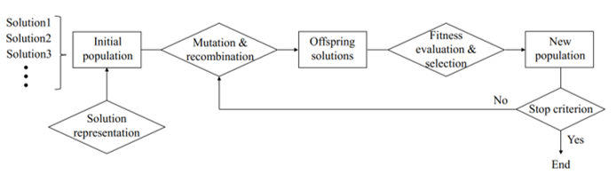
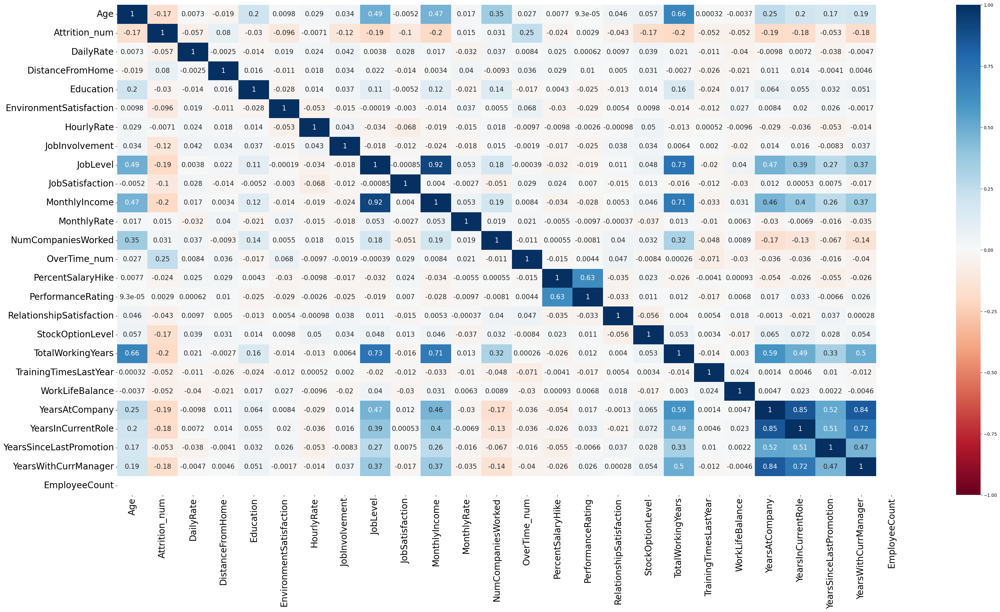
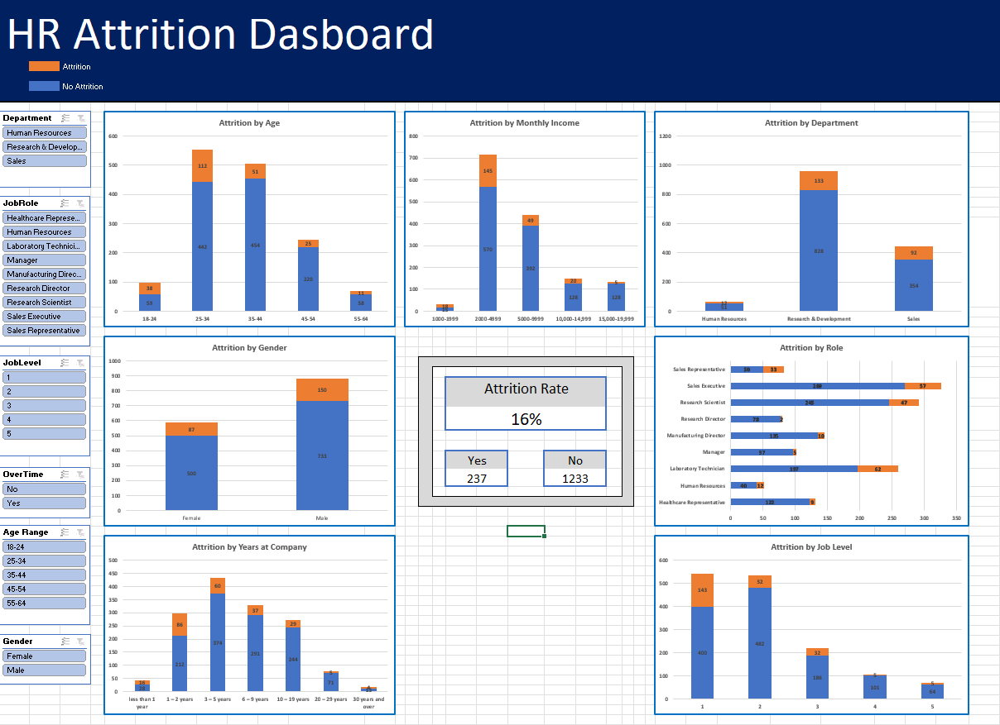

# Data Scientist

#### Technical Skills: Data Analysis, Data Visualisation, Databricks, Excel, Machine Learning, Microsoft Azure, Microsoft Office, Power BI, PySpark, Python, SQL

## Education
- BSc (Hons), Data Science | York St John University (_April 2025_)								       		

## Work Experience
**Junior Data Scientist @ Unilever (_September 2021 - June 2025_)**

<ins>Data Science</ins>
- Worked with stakeholders to gather requirements and translate these into data tasks
- Implemented Feature and Shape based Time Series Clustering Algorithms including K-Means, DBSCAN and Time Series K-Means with dynamic time warping and libraries tslearn and tsfresh to identify patterns in Trade Marketing Investments and extract the cluster representative. Communicated results in a presentation tailored to academic and stakeholder audiences
- Analysed, reviewed and implemented ML models including Extra Trees and Gradient Boosted Trees for Time Series Forecasting and deployed these to production and made improvements to code
- Tested the viability of using the Elastic Net model over Tree based models using experiments with tuning of hyperparameters on MLflow and delivered technical presentation with results to team
- Documented data, code and processes ensuring clarity, integrity, maintainability and reproducibility
 

<ins>Exploratory Data Analysis</ins>
- Investigated impact of pricing, macroeconomics and commodities on sales volume and sales value 
- Pre-processed data by collating, cleaning and manipulating large datasets using Python and 
- Conducted correlation analysis identifying relationships between features and created data visualisations, plots and summary statistics, unlocking insights, patterns and trends
- Researched latest, real-world trends and used these to inform analysis
- Identified customer behavioural patterns with the potential to be turned into a promotional campaign
- Worked with and provided mentorship to an Industrial Placement student in the completion of EDA
- Presented EDA with compelling visualisations using data-driven storytelling to manager and stakeholders communicating insights articulately and providing actionable information
 

<ins>Data Engineering</ins>
- Automated manual extracts of macroeconomic data by extracting data from an API, cleaning and manipulating the data, coding an update process and creating an automated pipeline in Azure Data Factory forming an ETL process increasing efficiency and improving quality and scalability
- Consulted with internal and external stakeholders ensuring high data quality and a robust pipeline
- Tested code ensuring a resilient update process when pipeline is run
 

<ins>Unilever Community</ins>
- Championed community building by leading Data Apprentice connects, producing monthly newsletters for over 100 Industrial Placement candidates, and supporting new joiners through buddying

**Management Information Analyst  @ Domestic & General (_July 2018 - June 2019_)**
- Collaborated with cross-functional teams to build robust MI processes and create and track KPIs
- Built and maintained daily, weekly, monthly and ad-hoc financial reports and MI reporting packs extracting, compiling and manipulating data from different sources using IBM Cognos, SQL queries and Excel. Ensured reports are delivered accurately and punctually
- Built and maintained financial dashboards to drive informed decision making across the business
- Used Python for report automation, increasing efficiency by 4 times

# Projects
## [Evolutionary Optimisation](https://github.com/junaid-din/evolutionary-optimisation) 

This project explores the principles of evolutionary optimisation through the reconstruction of a target text sequence—referred to as the master sequence—using random generation and mutation-based evolution. The goal is to mutate a random text sequence through corruption until it is indistinguishable from the original and then take the corrupted text, and have this evolve over generations so that they converge toward athe original. This simulates how optimisation algorithms can refine solutions over time, inspired by biological evolution.

* Selected the master sequence from the first two lines of a Shakespeare sonnet based on student number.
* Generated N random sequences of the same length using letters of the alphabet.
* Selected the sequence with the smallest distance to the master sequence.
* Created N mutated copies of this sequence, with each letter having a probability p of changing.
* Chose the best offspring to continue evolving toward the master sequence.
* Repeated the process for G generations or until the target sequence was exactly matched.
* Visualised the increase in the distance to the master sequence during corruption and reduction in distance to the master sequence during optmisation across generations.
* Investigated how string length, probability and letters affect convergence.
* Discussed real-world applications 

## [Employee Attrition Analysis and Excel Dashboard](https://github.com/junaid-din/employee-attrition-analysis-and-dashboard) 

This project is designed to help HR professionals better understand the underlying factors that contribute to employee attrition within an organization. High attrition rates can disrupt team dynamics, increase recruitment and training costs, and impact overall productivity. By analyzing employee data, the project aims to identify key trends and risk indicators such as job role, satisfaction levels, department etc. that may influence an employee’s likelihood to leave. These insights can support HR in developing targeted retention strategies, improving employee engagement, and proactively addressing potential issues before they lead to turnover offering HR teams a practical tool for monitoring attrition patterns and making informed, data-driven decisions.

* Identified and addressed data quality issues, including null values, duplicates etc.
* Performed data pre-processing steps such as cleaning, formatting, encoding and KNN Imputation to prepare the dataset for analysis
* Conducted exploratory data analysis (EDA) to uncover key patterns and insights related to employee attrition, including distributions, correlations, and trends across variables like age, department, job role, satisfaction levels and more
* Developed an interactive Excel dashboard to provide HR teams with clear, visual insights into employee attrition trends and risk factors, supporting strategic decision-making around workforce planning and retention

  
  

