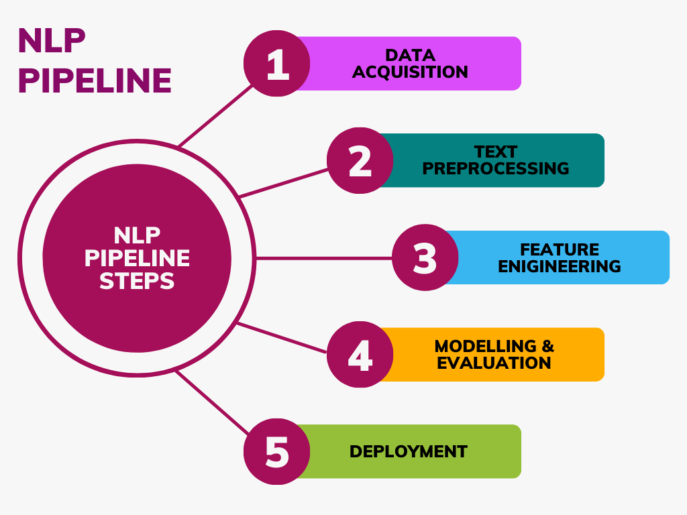
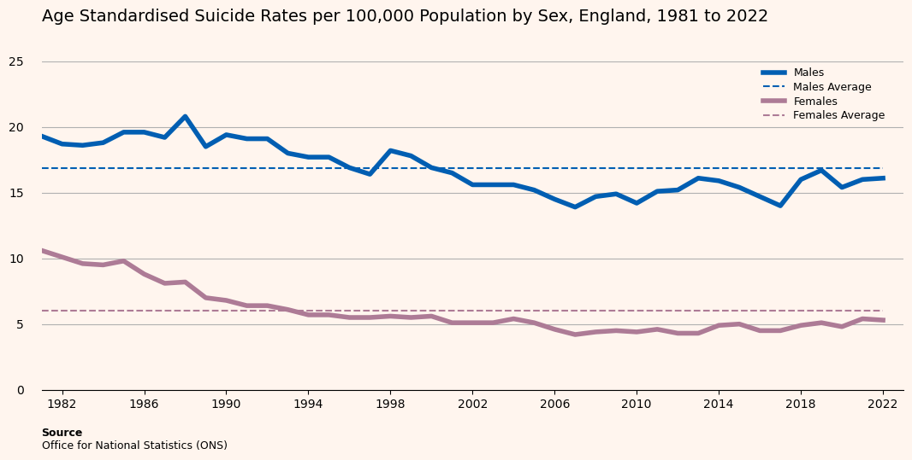
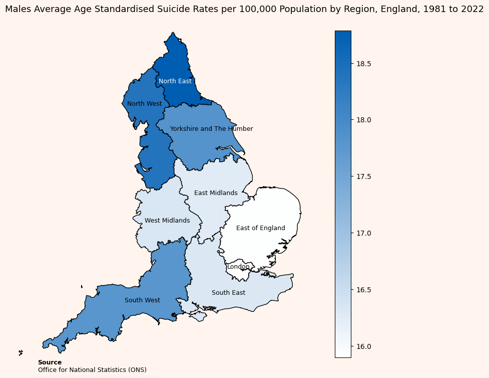
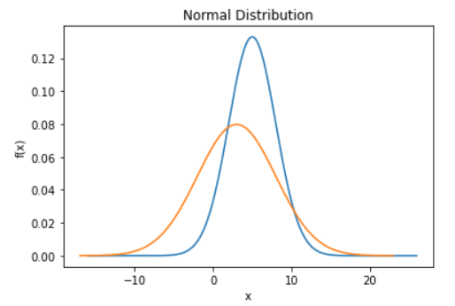
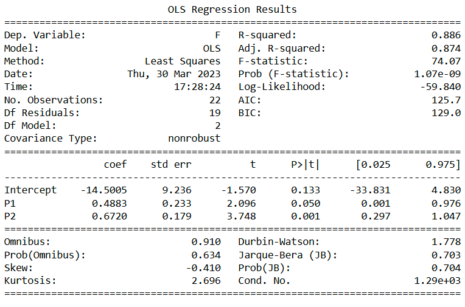
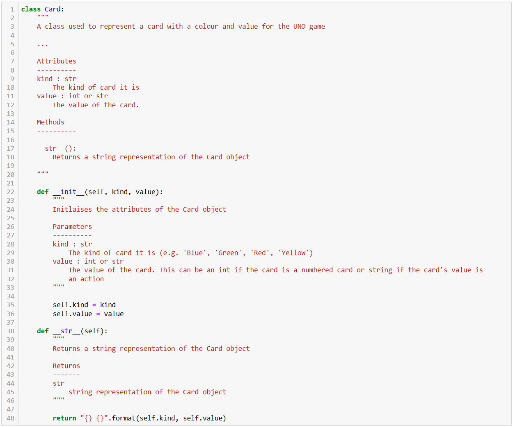
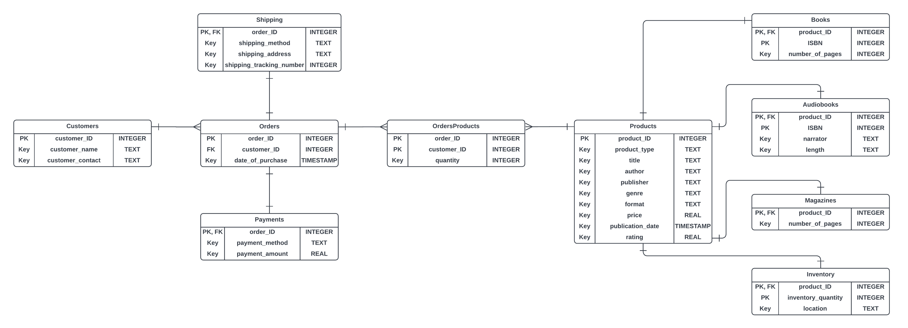
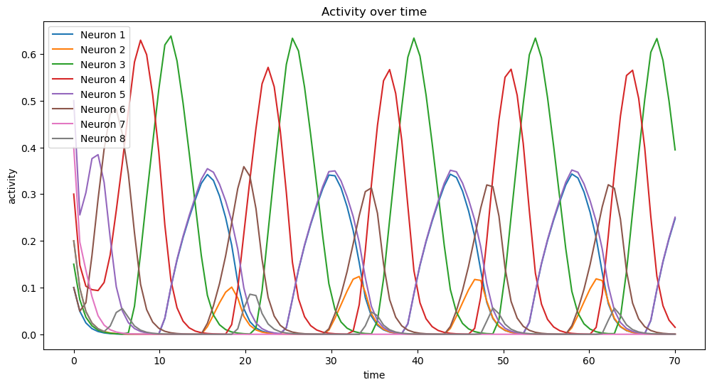

# Data Enthusiast

#### Technical Skills: Data Analysis, Data Visualisation, Databricks, Excel, Machine Learning, Microsoft Azure, Microsoft Office, Power BI, PySpark, Python, SQL

## Education
BSc (Hons) Data Science | York St John University (_April 2025_)	
First Class Honours

## Work Experience
**Junior Data Scientist @ Unilever (_September 2021 - June 2025_)**

<ins>Data Science</ins>
- Worked with stakeholders to gather requirements and translate these into data tasks
- Implemented Feature and Shape based Time Series Clustering Algorithms including K-Means, DBSCAN and Time Series K-Means with dynamic time warping and libraries tslearn and tsfresh to identify patterns in Trade Marketing Investments and extract the cluster representative. Communicated results in a presentation tailored to academic and stakeholder audiences
- Analysed, reviewed and implemented ML models including Extra Trees and Gradient Boosted Trees for Time Series Forecasting and deployed these to production and made improvements to code
- Tested the viability of using the Elastic Net model over Tree based models using experiments with tuning of hyperparameters on MLflow and delivered technical presentation with results to team
- Documented data, code and processes ensuring clarity, integrity, maintainability and reproducibility
 

<ins>Exploratory Data Analysis</ins>
- Investigated impact of pricing, macroeconomics and commodities on sales volume and sales value 
- Pre-processed data by collating, cleaning and manipulating large datasets using Python and PySpark
- Conducted correlation analysis identifying relationships between features and created data visualisations, plots and summary statistics, unlocking insights, patterns and trends
- Researched latest, real-world trends and used these to inform analysis
- Identified customer behavioural patterns with the potential to be turned into a promotional campaign
- Worked with and provided mentorship to an Industrial Placement student in the completion of EDA
- Presented EDA with compelling visualisations using data-driven storytelling to manager and stakeholders communicating insights articulately and providing actionable information
 

<ins>Data Engineering</ins>
- Automated manual extracts of macroeconomic data by extracting data from an API, cleaning and manipulating the data, coding an update process and creating an automated pipeline in Azure Data Factory forming an ETL process increasing efficiency and improving quality and scalability
- Consulted with internal and external stakeholders ensuring high data quality and a robust pipeline
- Tested code ensuring a resilient update process when pipeline is run
 

<ins>Unilever Community</ins>
- Championed community building by leading Data Apprentice connects, producing monthly newsletters for over 100 Industrial Placement candidates, and supporting new joiners through buddying

**Management Information Analyst  @ Domestic & General (_July 2018 - June 2019_)**
- Collaborated with cross-functional teams to build robust MI processes and create and track KPIs
- Built and maintained daily, weekly, monthly and ad-hoc financial reports and MI reporting packs extracting, compiling and manipulating data from different sources using IBM Cognos, SQL queries and Excel. Ensured reports are delivered accurately and punctually
- Built and maintained financial dashboards to drive informed decision making across the business
- Used Python for report automation, increasing efficiency by 4 times

# Projects

## [1. Deep Learning for Classification of Brain CT Scans](https://github.com/junaid-din/deep-learning-for-classification-of-ct-brain-scans) 

This project was undertaken as part of an Artificial Intelligence module and in collaboration with a use-case scenario from the NHS. The objective was to develop a deep learning model capable of classifying CT brain scan images into three medical conditions: cancer, tumour, and aneurysm. Using a dataset of 512 images in .jpg and .dcm formats. The project explored and compared the performance of a Convolutional Neural Network (CNN) and a Multilayer Perceptron (MLP) model. The project aimed to investigate the efficacy of these models in medical image classification tasks.

Tasks completed:

* Explored the dataset of 512 brain CT scans (which was assumed balanced across the 3 classes: cancer, tumour, aneurysm).
* Identified key data limitations including no class for "normal" brain scans as well as scans being from the same patient at different angles
* Preprocessed image data: Loaded images, normalized pixel values to range 0–1, encoded labels using LabelEncoder and to_categorical() and split into training and test sets
* Developed CNN and MLP models implementing early stopping to prevent overfitting
* Evaluated both deep learning models and compared results

## [2. Heart Disease Prediction using Machine Learning Models](https://github.com/junaid-din/machine-learning) 

This project applies machine learning techniques to predict the presence of heart disease using a real-world dataset sourced from Kaggle. The intention is to support early diagnosis and intervention for at-risk individuals, potentially reducing premature deaths due to heart disease. Several standard classification models were implemented, alongside a novel hybrid ensemble model using majority voting. The project showed that ensemble models generally outperform individual classifiers in accuracy and recall. Emphasis was placed on data quality, pre-processing, feature engineering, and model evaluation using relevant metrics.

Tasks completed:

* Performed data pre-processing: checked for null values, duplicate rows, outliers and class imbalance. Removed non-sensical observations
* Performed exploratory data analysis (EDA): used descriptive statistics, feature correlations and distributions
* Transformed categorical variables into numeric using encoding via the pd.get_dummies() function
* Scaled numerical features using StandardScaler
* Trained the following models: K-Nearest Neighbours (KNN), Logistic Regression, Decision Tree using GridSearchCV for hyperparameter tuning with cross-validation.
* Developed a Majority Voting Ensemble model
* Evaluated model performance using metrics such as accuracy, recall and confusion matrices

  
  

## [3. Natural Language Processing (NLP) Pipeline and Classification of Cyberbullying Tweets](https://github.com/junaid-din/nlp-pipeline-for-cyberbullying-tweet-classification) 

This project aims to develop a natural language processing (NLP) pipeline to classify tweets based on whether they contain instances of cyberbullying. The goal is to contribute to efforts in detecting and preventing online harassment using NLP. Tweets were preprocessed through a robust NLP pipeline and vectorized using TF-IDF. Two classification models, Linear Support Vector Classifier (SVC) and Multinomial Naive Bayes, were trained and evaluated. A dummy classifier was used as a baseline. The models were then compared.

Tasks completed:

* Conducted a literature review on prior use of NLP and classification models and the performance of these
* Loaded and explored a labelled dataset of tweets related to cyberbullying
* Built an NLP preprocessing pipeline which: expanded contractions, used the tweet preprocessor, used a defined clean function, tokenised and removed stopwords, performed lammatisation and removed repetitions
* Transformed the cleaned text using TF-IDF vectorization
* Implemented and trained three models: Linear Support Vector Classifier (SVC), Multinomial Naive Bayes and a Dummy Classifier as a performance baseline
* Performed hyperparameter tuning with GridSearchCV
* Evaluated all models using: Accuracy, Precision, Recall and F1-score
* Compared results and concluded that Linear SVC outperformed other models.
* Suggested future improvement via ensemble learning (e.g., majority voting classifiers).

## [4. HR Analytics: Employee Attrition EDA and Excel Dashboard](https://github.com/junaid-din/employee-attrition-analysis-and-dashboard) 

This project aims to help HR professionals better understand the underlying factors that contribute to employee attrition within an organization. High attrition rates can disrupt team dynamics, increase recruitment and training costs, and impact overall productivity. By analysing employee data, the project aims to identify key trends and risk indicators such as job role, satisfaction levels, department etc. that may influence an employee’s likelihood to leave. These insights can support HR in developing targeted retention strategies, improving employee engagement, and proactively addressing potential issues before they lead to turnover offering HR teams a practical tool for monitoring attrition patterns and making informed, data-driven decisions.

Tasks completed:

* Identified and addressed data quality issues, including null values, duplicates etc.
* Performed data pre-processing steps such as cleaning, formatting, encoding and KNN Imputation to prepare the dataset for analysis
* Conducted exploratory data analysis (EDA) to uncover key patterns and insights related to employee attrition, including distributions, correlations, and trends across variables like age, department, job role, satisfaction levels and more
* Developed an interactive Excel dashboard to provide HR teams with clear, visual insights into employee attrition trends and risk factors, supporting strategic decision-making around workforce planning and retention

  
  

## [5. Suicide Patterns in England Using Data Visualisation](https://github.com/junaid-din/data-visualisation) 

This project explores suicide patterns and trends across three distinct population groups in England: the general population, prison inmates, and higher education students. Leveraging datasets from the Office for National Statistics (ONS), the study uses data visualisation techniques to highlight demographic, temporal, and regional trends in suicide rates. The goal is to uncover insights that can inform more targeted and effective suicide prevention strategies. By combining multiple data sources and applying accessible, theory-backed visual design principles, the project reveals disparities and risk concentrations often hidden in raw statistics.

Tasks completed:

* Preprocessed and cleaned data
* Applied visualisation techniques, including: Line plots (for temporal suicide rate trends), Heatmaps (for age-specific rate patterns over time), Choropleth maps (to explore regional disparities in suicide rates), Bar charts (for comparisons across groups)
* Applied colour theory and accessibility design by using colourblind-safe palettes and gender-representative colours as well as high contrast and minimalistic design for clarity
* Integrated Gestalt theory and the principle of proportional ink to enhance visual intuitiveness

  
  

## [6. Statitical Modelling and Analysis](https://github.com/junaid-din/modelling-and-statistical-analysis) 

This Project conducts a comprehensive statistical analysis by applying a variety of statistical modelling and inference techniques using Python. The analysis involves simulating data from known distributions, visualizing them, conducting hypothesis tests, fitting statistical models (linear and logistic regression), checking assumptions and evaluating their performance.

Tasks completed:

* Generated and plotted the Probability Density Function (PDF) different Normal distributions
* Calculated confidence intervals
* Fitted multiple linear regression models with different sets of predictors and interpreted their coefficients and model statistics
* Conducted hypothesis testing (t-tests, ANOVA)
* Checked standard regression assumptions (linearity, residual assumptions, homoscedasticity, predictor assumptions etc.)
* Fitted multiple logistic regression models and interpreted their coefficients and model statistics

  
  

## [7. Object-Oriented Programming (OOP) Implementation of the UNO Card Game in Python](https://github.com/junaid-din/creating-the-uno-card-game-in-python-using-oop) 

This project implements a fully functional UNO card game for two players using Object-Oriented Programming (OOP) in Python within a Jupyter Notebook. The design emphasizes clean structure, encapsulation, inheritance, and other OOP principles, while simulating the core rules and mechanics of a traditional UNO game. The implementation includes support for house rules, persistent game state saving and robust validation. 

* Created classes for cards, players, deck, and game logic
* Used encapsulation and inheritance where appropriate
* Applied clean coding practices including Consistent naming conventions, DRY principle and comprehensive docstrings and comments throughout
* The logic of all Special Cards (skip turn, take 2, swap direction, wild card, take 4) have been implemented as well as the house rule of swap hands
* Players cannot play invalid Cards and can draw a Card instead of playing
* The Game state is continuously saved to a pickle file in a game session and if the game session were to be exited, the same session can be loaded from the pickle file
* Robust in-notebook testing has been included to demonstrate gameplay functionality

## [8. Designing the Bookshelfia Database in 3rd Normal Form (3NF) and Querying with SQL](https://github.com/junaid-din/databases) 

This project analyzing, designing, and implementing a relational database system for Bookshelfia, an online bookstore that sells books, magazines, and audiobooks. The goal was to support inventory management, order processing, and customer transactions. I acted in the role of a database designer, and developer, applying best practices in relational database design, normalising the database to 3rd Normal Form (3NF). The normalisation steps of the data are shown in a separate Excel workbook called 'Normalisation steps'. I also developed SQL scripts to query the database. The project culminated in a fully functional database prototype, including a Entity-Relationship Diagram (ERD), populated tables, and a suite of analytical SQL queries.

Tasks completed:

* Created an artificial dataset using the Faker Python Package
* Designed a relational database schema that covers products, customers, orders, payments, and inventory.
* Created an Entity-Relationship Diagram (ERD) to visualize relationships using primary and foreign keys.
* Ensured normalization to Third Normal Form (3NF) to eliminate redundancy and maintain data integrity.
* Created database tables and populated them with sample data.
* Developed SQL queries to answer key business questions:

## [9. Evolving Text Sequences with Evolutionary Optimisation Algorithms](https://github.com/junaid-din/evolutionary-optimisation) 

This project explores the principles of evolutionary optimisation through the reconstruction of a target text sequence, referred to as the master sequence, using random generation and mutation-based evolution. The goal is to mutate a random text sequence through corruption until it is indistinguishable from the original and then take the corrupted text, and have this evolve over generations so that they converge toward athe original. This simulates how optimisation algorithms can refine solutions over time, inspired by biological evolution.

Tasks completed:

* Selected the master sequence from the first two lines of a Shakespeare sonnet based on student number
* Generated N random sequences of the same length using letters of the alphabet
* Selected the sequence with the smallest distance to the master sequence
* Created N mutated copies of this sequence, with each letter having a probability p of changing
* Chose the best offspring to continue evolving toward the master sequence
* Repeated the process for G generations or until the target sequence was exactly matched
* Visualised the increase in the distance to the master sequence during corruption and reduction in distance to the master sequence during optmisation across generations
* Investigated how string length, probability and letters affect convergence
* Discussed real-world applications 

## [10. Simulating Neural Dynamics in Combinatorial Threshold-Linear Networks (CTLNs)](https://github.com/junaid-din/dynamics-of-linear-threshold-neural-networks) 

This project investigates the dynamics of Combinatorial Threshold-Linear Networks (CTLNs) which are a subclass of threshold-linear networks (TLNs). CTLNs consist of simplified neuron models where activation is governed by linear dynamics. Despite their simplicity, these networks exhibit rich emergent behavior such as limit cycles, chaotic behaviour etc, all driven by the structure of the network's connectivity. A system of ordinary differential equations (ODEs) was used to model the dynamics of the network. Through the use of the odeint function of the scipy module in Python, the ODEs can be solved. The solved solution can then be visualised. It was also investigated how varying initial conditions and parameters impact dynamic behaviour. This project observed the dynamics of a two different 3-neuron CTLN networks and an 8-neuron CTLN network

Tasks completed:

* Created multiple CTLN networks with varying sizes
* Simulated network dynamics from various initial conditions and parameter values
* Visualized results using time-series plots of neuronal activity

